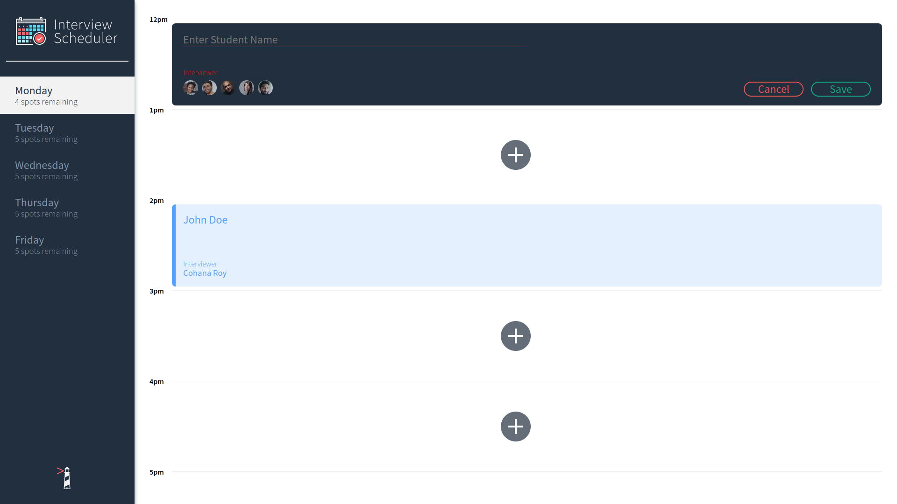
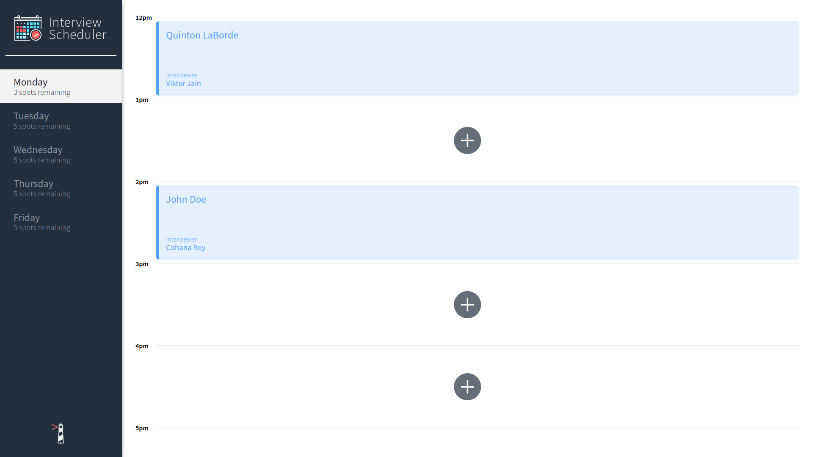
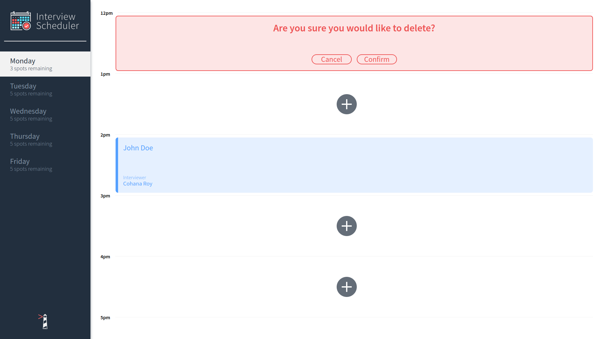

# Interview Scheduler






### Netlify is serving the static client assets. Link is in the GitHub project description

### CircleCI is managing the continuous integration process

### Server is deployed on Heroku
https://i-scheduler-lhl.herokuapp.com/api/days


## Setup

Install dependencies with `npm install`.

## Running Webpack Development Server

```sh
npm start
```

## Running Jest Test Framework

```sh
npm test
```

## Running Storybook Visual Testbed

```sh
npm run storybook
```
